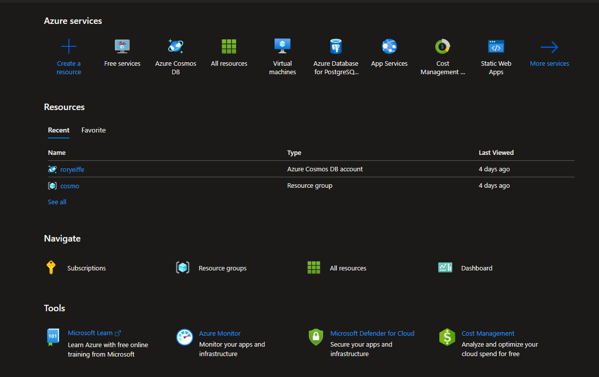

- [IaaS, PaaS, SaaS](https://www.ibm.com/cloud/learn/iaas-paas-saas)
- 

## Overview of Azure
- Microsoft's version of AWS
- [Overview](https://azure.microsoft.com/en-us/resources/cloud-computing-dictionary/what-is-azure/)
- [List of Services that Azure Offers](https://azure.microsoft.com/en-us/products/)
- [Comparison of AWS to Azure Services](https://docs.microsoft.com/en-us/azure/architecture/aws-professional/services)
- [Documentation](https://docs.microsoft.com/en-us/azure/?product=popular)

## Resources
- [Azure Resource Manager](https://docs.microsoft.com/en-us/azure/azure-resource-manager/management/overview)
- A resource is a service that we use with Azure (Virtual Machine, storage account, so on)
- A resource group is a logical grouping of many different resources
    - we could group them by type (virtual machine group, storage group, etc.)
    - group them by stages of the development cycle (testing, development, etc.)
    - you can group them however you see fit

## Regions

- An Azure Region is a geographical place in the world (US East, US West, US East 2)
- Each Region has multiple Availability Zones, for fault tolerance
- Each availability zone has mulitple physical data centers
- when we create an Azure resource, we will be asked to pick a region in which to deploy it
- when picking your region, it's important to keep in mind:
    - where the customer base is
    - where you, or the development team, are/is
    - which services are available, not all services are available in every region
    - pricing
- [Azure Region Overview](https://docs.microsoft.com/en-us/azure/availability-zones/az-overview)
- [Browse Products by Region](https://azure.microsoft.com/en-us/global-infrastructure/services/)

## Pricing
- Azure is pay-as-you-go, where you only pay for what you use
- the prices are affected by
    - the type of the resource
    - the quality of the resource, (how much storage in a database, how many CPUs on a virtual machine)
    - differences in region
- pay for support plans
- price plans for 1 year, 3 year
    - commit to using a service for a certain amout of time, the prices may be reduced
- We can use the Azure website to pick a service and view the cost estimates
- We can use the Azure pricing calculator to see how much an entire application would cost per month
- [Azure Pricing Overview](https://azure.microsoft.com/en-us/pricing/#product-pricing)
- [Azure Pricing Calculator](https://azure.microsoft.com/en-us/pricing/calculator/)

## TODO before next class:
- Review notes, prepare any questions
- Get your account, free trial set up with 200 credits
- If you're able to see the main page once you log in you should be good:
- 
